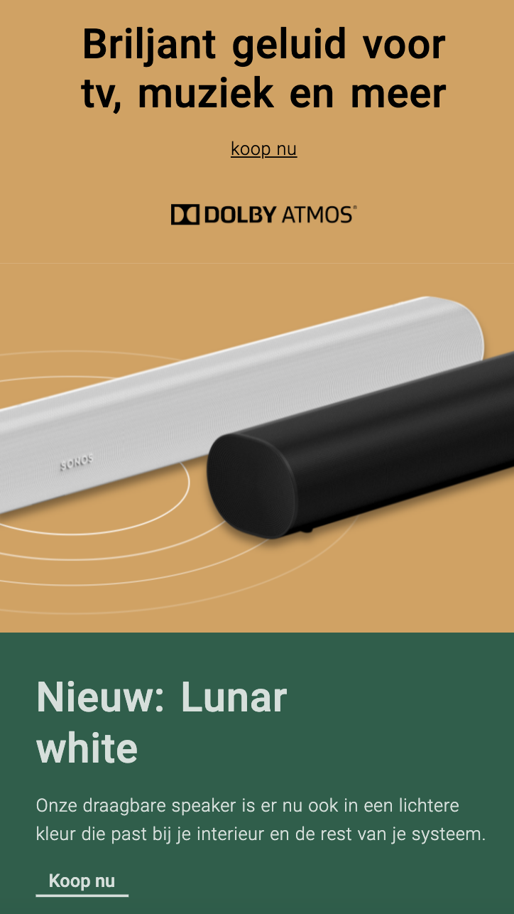

# Procesverslag
**Auteur:** -jouw naam-

Markdown cheat cheet: [Hulp bij het schrijven van Markdown](https://github.com/adam-p/markdown-here/wiki/Markdown-Cheatsheet). Nb. de standaardstructuur en de spartaanse opmaak zijn helemaal prima. Het gaat om de inhoud van je procesverslag. Besteedt de tijd voor pracht en praal aan je website.

## Bronnenlijst
1. https://codepen.io/mutedblues/pen/MmPNPG
2. https://codepen.io/pirrera/pen/rayoLW
3. https://codepen.io/samternent/pen/azWxpp
4. https://codepen.io/nehasharma/pen/LELPEB
5. https://css-tricks.com/line-on-sides-headers/
6. https://css-tricks.com/how-to-make-a-css-only-carousel/

## Eindgesprek (week 7/8)

-dit ging goed & dit was lastig-

**Screenshot(s):**

-screenshot(s) van je eindresultaat-

## Voortgang 3 (week 6)

-same as voortgang 1-

## Voortgang 2 (week 5)

-same as voortgang 1-

## Voortgang 1 (week 3)

### Stand van zaken

-dit ging goed & dit was lastig-
Ires vond dat we/ik goed opweg waren.
Ze zei dat wij al veel meer hadden dan de mensen uit het vorige blok.
Ik heb nu bijna de eerste pagina af.
2-12-20
Ires gecontacteerd, om te helpen met een carousel. Maar ik kom er nog steeds niet uit. Daarom janno gecontacteerd.

**Screenshot(s):**

Op de eerste screenshot is te zien dat ik de navigatie balk en carousel af heb.
op de tweede screenshot is te zien dat ik de DolbyAtmos sectie af heb met de boxen als screenshot.
Op de derde screenshot is te zien dat ik de Witte move box juist heb weten te plaatsen.

### Agenda voor meeting

-samen met je groepje opstellen-

PALENQUE WIL DIT:
    •Moet ik de carousel/slider/button maken met gewoon css?
    •Moet ik de foto’s van insta “life” er in zetten?
    •Moeten de links binnen je eigen website terug linken naar de andere pagina?

SARAH WIL DIT:
    •hoe zet ik een hartje op me foto’s en hoe bewerk ik dit goed met Javascript
    •Ik twijfel of me site wel goed responsive is, heb ik wel de juiste code gebruikt hiervoor
    •Hoe ga ik de tab bar verwerken in me website?
    •Hoe stijl ik de dropdown list met de foto’s etc er in op me detailpagina

SUSAN WIL DIT:
    •Hoe voeg je een eigen lettertype toe? (Ik heb een lettertype dat eindigt op .otf)
    •Hoe kun je het beste witruimte oplossen? Is dat alleen te doen met postion:absolute?
    •Hoe maak je een uitklapfooter?
    •Moet in Github ook de opdrachten komen te staan wat je hebt gemaakt in codepen.io?

SUZANNE (ik) WIL DIT:
    • ik wil graag weten of ik mijn talen selectie onderin de footer moet maken en hoe?
    • of ik de achtergrond van de kerst banner moet uitwerken?
    • hoe ik mijn navigatie dingen het beste kan maken met js?

### Verslag van meeting

-na afloop snel uitkomsten vastleggen-
12-11-20

Ik heb flinken ruzie met de css van mijn menu.
16-11-20
De menu of navigatiebalk is enorm gecompliceerd bij sonos en ik weet nog niet hoe ik dit voor elkaar ga krijgen.
gebruik dit:
https://codepen.io/mutedblues/pen/MmPNPG
en dit,
https://codepen.io/pirrera/pen/rayoLW
18-11-20
Ik heb van Lars Kamman bij les gehad over js. Ik ben op advies van Lars over gestapt van responsive naar aandacht van de surface laag. Dit omdat ik voor mijn header al veel moest doen met js.
23-11-20
Vandaag heb ik al mijn HTML afgemaakt
25-11-20
Ik mocht van Ires bij de dolby atmos pagina een screenshot maken van hoe de arc boxen gestyled zijn. Want dat kost heel veel tijd en is een behoorlijke uitdaging. Ik wil nu eerst focussen het afhebben van de pagina.

## Breakdownschets (week 1)

-uitwerken voor de 1e werkgroep - eind van de eerste week-

## Intake (week 1)
-uitwerken voor de kick-off werkgroep - begin van de eerste week-

**Je startniveau:** -Combinatie van vooral blauw met een beetje rood-

**Je focus:** -Ik kies voor extra
aandacht voor de surface laag-

**Je opdracht:** -https://www.sonos.com/nl-nl/home-

**Screenshot(s) van de eerste pagina (small screen):**

**Screenshot(s) van de tweede pagina (small screen):**

